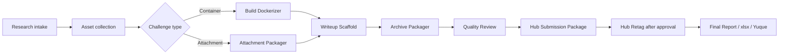

# CloverSec CTF For Example

<p align="center">
  <strong>Codex-native CTF collection, conversion, writeup, archive, review, Hub preparation, and final reporting plugin.</strong>
</p>

<p align="center">
  <a href="https://github.com/D1a0y1bb/CloverSec-CTF-ForExample/releases/tag/v0.2.2"></a>
  
  
  
</p>

<p align="center">
  <a href="#overview">Overview</a>
  · <a href="#install">Install</a>
  · <a href="#skills">Skills</a>
  · <a href="#workflow">Workflow</a>
  · <a href="#mcp-search">MCP Search</a>
  · <a href="#development">Development</a>
</p>

## Overview

CloverSec CTF For Example is a Codex plugin marketplace for internal CTF production workflows. It packages 10 Codex skills and MCP servers to help an agent move from public contest research to challenge asset collection, container or attachment conversion, writeup scaffolding, resource archiving, quality review, Hub submission preparation, post-review image retagging, and final xlsx/Yuque reporting.

The repository is designed as a GitHub-installable Codex marketplace. A teammate can add this repository from Codex, install `cloversec-ctf-forexample`, and then use the packaged skills from a fresh Codex thread.

Current version: `v0.2.2`

## Install

In Codex, open **Plugins -> Add plugin marketplace** and fill:

```text
Source: D1a0y1bb/CloverSec-CTF-ForExample
Git reference: v0.2.2
Sparse path: empty
```

If the UI supports multiple sparse paths, this smaller checkout also works:

```text
.agents/plugins
plugins
```

CLI install:

```bash
codex plugin marketplace add D1a0y1bb/CloverSec-CTF-ForExample --ref v0.2.2
codex plugin list
codex plugin add cloversec-ctf-forexample@cloversec-ctf
```

Development build:

```bash
codex plugin marketplace add D1a0y1bb/CloverSec-CTF-ForExample --ref main
codex plugin add cloversec-ctf-forexample@cloversec-ctf
```

Update an existing marketplace:

```bash
codex plugin marketplace upgrade cloversec-ctf
codex plugin add cloversec-ctf-forexample@cloversec-ctf
```

After installing or updating, start a new Codex thread so the app can pick up the latest skills and MCP tools.

## Skills

| Skill | Purpose |
| --- | --- |
| `cloversec-ctf-research-intake` | Search CTF contests, challenges, writeups, public archives, and evidence sources. |
| `cloversec-ctf-asset-collector` | Collect GitHub release assets, raw files, repository trees, direct attachments, writeups, screenshots, and evidence. |
| `cloversec-ctf-build-dockerizer` | Convert source or legacy environments into validated Docker challenge deliverables. |
| `cloversec-ctf-attachment-packager` | Inspect offline attachment challenges, archives, hashes, extraction status, and xlsx fields. |
| `cloversec-ctf-writeup-scaffold` | Generate internal manual templates, writeup drafts, Hub fields, and xlsx drafts. |
| `cloversec-ctf-archive-packager` | Build final archive directories with source, attachments, image tar indexes, writeups, screenshots, and manifests. |
| `cloversec-ctf-quality-review` | Check resources, manuals, Flag fields, Docker evidence, archive completeness, and final verification status. |
| `cloversec-ctf-hub-submission` | Prepare Hub form fields, upload manifests, screenshots, and submission packages without saving credentials. |
| `cloversec-ctf-hub-retag` | Generate post-review Hub ID image tag and amd64 tar export plans. |
| `cloversec-ctf-final-report` | Generate final `archive.xlsx`, Yuque table, Markdown report, JSON report, and remaining action list. |

## Workflow



Core data is carried through `ctf_case.json` or `ctf_cases.jsonl`. The final xlsx export keeps the complete `Flag` field because this is an internal archive requirement.

## MCP Search

The plugin includes seven local stdio MCP servers:

- `cloversec-ctf-search` for CTF public-source search, URL fetch, GitHub Release listing, and Agent web-search result import.
- `cloversec-ctf-search-plus` for unified free-source, Agent web, browser visible, direct URL, GitHub evidence, safe preview, and compact JSON output.
- `cloversec-ctf-browser-search` for browser-assisted Google/Baidu/CSDN/Cnblogs/Yuque search planning and visible-result import.
- `cloversec-ctf-docker` for controlled Docker build/load/inspect/run/logs/stop/save evidence.
- `cloversec-ctf-archive` for batch archive directories, resource indexes, final xlsx, Yuque tables, and missing reports.
- `cloversec-ctf-quality-runner` for batch quality evidence across resources, Docker, manuals, Flag, and archive state.
- `cloversec-ctf-hub-assistant` for safe Hub browser/Chrome filling plans, upload-result merge, and pre-submit validation.

Available tools:

| Tool | Purpose |
| --- | --- |
| `cloversec_ctf_search_plus` | Merge free sources, Agent web results, browser visible results, direct URLs, explicit GitHub repos, scoring, and short JSON output. |
| `cloversec_ctf_discover` | Search free public sources plus GitHub code search through token or local `gh auth`. |
| `cloversec_ctf_ctftime_events` | Fetch CTFTime events for a target year and optional query. |
| `cloversec_ctf_fetch_url` | Fetch URL metadata, title, text, hash, and status. |
| `cloversec_ctf_github_release_assets` | List downloadable GitHub Release assets. |
| `cloversec_ctf_import_agent_web_results` | Import web search results gathered by the current Agent and score them into CloverSec layers. |
| `cloversec_ctf_browser_search_plan` | Create a browser-assisted Google/Baidu/CSDN/Cnblogs/Yuque search plan, optionally opening the search page. |
| `cloversec_ctf_browser_search_import_visible` | Import visible browser search results without reading cookies, tokens, localStorage, sessionStorage, passwords, or captcha data. |
| `cloversec_ctf_browser_search_dom_to_visible` | Convert user-confirmed Chrome/Codex visible DOM, HTML, text, or links into `visible_results.json` and scored results. |
| `cloversec_ctf_docker_plan` | Create a Docker execution plan without running Docker. |
| `cloversec_ctf_docker_execute` | Run controlled Docker operations and write evidence with platform, probes, logs, tar hash, and failures. |
| `cloversec_ctf_archive_batch` | Generate archive directories, resource index, manifests, final xlsx, Yuque table, and missing report from `ctf_cases.jsonl`. |
| `cloversec_ctf_quality_run` | Generate batch quality evidence across resources, Docker, manuals, Flag, and archive state. |
| `cloversec_ctf_hub_chrome_plan` | Create a Chrome-assisted Hub filling plan that stops before final submit. |
| `cloversec_ctf_hub_validate_manifest` | Validate Hub classify ID, required fields, upload results, and screenshot slots. |
| `cloversec_ctf_hub_apply_upload_results` | Merge visible Hub upload results back into the manifest. |

Free sources:

- GitHub repository search
- GitHub code search through `GITHUB_TOKEN`, `GH_TOKEN`, or local `gh auth token` when available
- CTFTime events/writeups
- DuckDuckGo Lite HTML
- Built-in public CTF archive seeds
- CTF platform seeds as `platform_lead` / `lead_only`
- CSDN, Cnblogs, and Yuque `site:` search through DuckDuckGo

Optional GitHub search:

- `GITHUB_TOKEN` or `GH_TOKEN` for GitHub code search
- `CLOVERSEC_DISABLE_GH_AUTH_TOKEN=1` to disable reading local `gh auth token`

Search results are scored into:

- `confirmed_challenge`
- `writeup_candidate`
- `attachment_candidate`
- `platform_lead`
- `noise`

Google/Baidu HTML direct scraping is not treated as a stable default path. Use the Agent's current web-search capability when it exists, then pass results into `cloversec_ctf_search_plus` or import through `cloversec_ctf_import_agent_web_results`. For pages that need a human browser because of captcha, login, or risk control, use `cloversec-ctf-browser-search`; it only records visible titles, URLs, snippets, ranks, and blocked status.

When default free sources return too few candidates, `cloversec_ctf_discover` adds a `recall_recovery` section and runs relaxed public-web/site-search queries. Recovery results are marked with `year_relaxed=true` and must be treated as leads until evidence confirms the requested year and challenge.

Search is not a universal downloader. If a contest is cold, a Chinese page is poorly indexed, an attachment is removed, or a netdisk link has expired, the next step is Agent web search, Chrome browser-assisted review, or a user-provided entry URL. `search-plus` records that as a decision item instead of pretending the asset was found.

## Asset Collection Commands

```bash
python3 plugins/cloversec-ctf-forexample/scripts/cloversec_ctf_search.py discover \
  --query "LA CTF 2024 web challenge writeup" \
  --year 2024 \
  --limit 20 \
  --output search_results.json \
  --cases-jsonl ctf_cases.jsonl

python3 plugins/cloversec-ctf-forexample/scripts/cloversec_ctf_search.py import-agent-search \
  --input agent_web_results.json \
  --query "IrisCTF 2025 web writeup" \
  --provider agent-web-search \
  --output search_results.agent.json

python3 plugins/cloversec-ctf-forexample/scripts/cloversec_ctf_browser_search.py plan \
  --query "IrisCTF 2025 web writeup" \
  --engine google \
  --output browser_search_plan.json

python3 plugins/cloversec-ctf-forexample/scripts/cloversec_ctf_search.py github-release-assets \
  --repo owner/repo \
  --output github_release_assets.json

python3 plugins/cloversec-ctf-forexample/scripts/cloversec_ctf_search.py download-github-release-assets \
  --repo owner/repo \
  --output-dir downloads \
  --output release_downloads.json

python3 plugins/cloversec-ctf-forexample/scripts/cloversec_ctf_search.py download-github-raw \
  https://github.com/owner/repo/blob/main/path/challenge.zip \
  --output-dir downloads \
  --output raw_download.json

python3 plugins/cloversec-ctf-forexample/scripts/cloversec_ctf_search.py download-github-tree \
  --repo owner/repo \
  --ref main \
  --path-prefix challenges \
  --asset-only \
  --output-dir downloads \
  --output tree_downloads.json

python3 plugins/cloversec-ctf-forexample/scripts/cloversec_ctf_search.py preview-archive \
  downloads/challenge.zip \
  --output archive_preview.json
```

Downloads only support `http://` and `https://`. HTTP 4xx/5xx responses are recorded as issues and are not saved as successful attachments. Archive preview supports zip and tar with Python standard library inspection and reports unsafe paths.

## Repository Layout

```text
.agents/plugins/marketplace.json
plugins/cloversec-ctf-forexample/
  .codex-plugin/plugin.json
  .mcp.json
  skills/
  scripts/
  references/
tests/
scripts/
.github/workflows/release.yml
```

## Boundaries

- Hub automation currently prepares fields, upload packages, screenshots, Chrome/browser plans, upload-result merge, and pre-submit validation. It does not save credentials, read cookies, or click final submit.
- Hub browser assistance uses the user's active browser session only after explicit confirmation and stops before the final submit action.
- Full Flag values are intentionally written into internal xlsx/Yuque outputs.
- Public repository content must not include private challenge assets, internal xlsx files, Hub credentials, cookies, tokens, or private writeups.
- Docker execution is opt-in. `cloversec_ctf_review.py --execute-docker` runs controlled load/inspect/run/probe/logs/stop/rm, and `cloversec_ctf_retag.py --execute` runs controlled tag/save/load/inspect.

## Development

Run the release validation suite before publishing:

```bash
python3 scripts/validate_release.py
python3 /Users/d1a0y1bb/.codex/skills/.system/plugin-creator/scripts/validate_plugin.py plugins/cloversec-ctf-forexample
for d in plugins/cloversec-ctf-forexample/skills/*; do
  python3 /Users/d1a0y1bb/.codex/skills/.system/skill-creator/scripts/quick_validate.py "$d" || exit 1
done
python3 -m py_compile $(find plugins/cloversec-ctf-forexample/scripts -name '*.py' -print) scripts/validate_release.py scripts/package_plugin_release.py
python3 -m unittest discover -s tests -p 'test_*.py'
pytest -q
python3 scripts/package_plugin_release.py
```

Release tags must match `plugin.json`:

```text
plugin version 0.2.2 -> git tag v0.2.2
```

The GitHub Release workflow validates metadata, compiles scripts, runs tests, packages release assets, and creates the GitHub Release.

## Release Assets

Generated assets:

- `cloversec-ctf-forexample-<version>.zip`
- `cloversec-ctf-forexample-<version>.tar.gz`
- `cloversec-ctf-forexample-<version>-repo-marketplace.zip`
- `release-notes.md`

Users should install from the GitHub repo marketplace rather than manually unpacking these assets. The assets are provided for archival and offline inspection.
