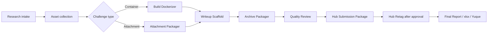

# CloverSec CTF ForExample

<p align="center">
  <strong>Codex-native CTF collection, conversion, writeup, archive, review, Hub preparation, and final reporting plugin.</strong>
</p>

<p align="center">
  <a href="https://github.com/D1a0y1bb/CloverSec-CTF-ForExample/releases/tag/v0.1.2"></a>
  
  
  
</p>

<p align="center">
  <a href="#overview">Overview</a>
  · <a href="#install">Install</a>
  · <a href="#skills">Skills</a>
  · <a href="#workflow">Workflow</a>
  · <a href="#mcp-search">MCP Search</a>
  · <a href="#development">Development</a>
</p>

## Overview

CloverSec CTF ForExample is a Codex plugin marketplace for internal CTF production workflows. It packages 10 Codex skills and one MCP server to help an agent move from public contest research to challenge asset collection, container or attachment conversion, writeup scaffolding, resource archiving, quality review, Hub submission preparation, post-review image retagging, and final xlsx/Yuque reporting.

The repository is designed as a GitHub-installable Codex marketplace. A teammate can add this repository from Codex, install `cloversec-ctf-forexample`, and then use the packaged skills from a fresh Codex thread.

Current version: `v0.1.2`

## Install

In Codex, open **Plugins -> Add plugin marketplace** and fill:

```text
Source: D1a0y1bb/CloverSec-CTF-ForExample
Git reference: v0.1.2
Sparse path: empty
```

If the UI supports multiple sparse paths, this smaller checkout also works:

```text
.agents/plugins
plugins
```

CLI install:

```bash
codex plugin marketplace add D1a0y1bb/CloverSec-CTF-ForExample --ref v0.1.2
codex plugin list
codex plugin add cloversec-ctf-forexample@cloversec-ctf
```

Development build:

```bash
codex plugin marketplace add D1a0y1bb/CloverSec-CTF-ForExample --ref main
codex plugin add cloversec-ctf-forexample@cloversec-ctf
```

Update an existing marketplace:

```bash
codex plugin marketplace upgrade cloversec-ctf
codex plugin add cloversec-ctf-forexample@cloversec-ctf
```

After installing or updating, start a new Codex thread so the app can pick up the latest skills and MCP tools.

## Skills

| Skill | Purpose |
| --- | --- |
| `cloversec-ctf-research-intake` | Search CTF contests, challenges, writeups, public archives, and evidence sources. |
| `cloversec-ctf-asset-collector` | Collect GitHub release assets, raw files, repository trees, direct attachments, writeups, screenshots, and evidence. |
| `cloversec-ctf-build-dockerizer` | Convert source or legacy environments into validated Docker challenge deliverables. |
| `cloversec-ctf-attachment-packager` | Inspect offline attachment challenges, archives, hashes, extraction status, and xlsx fields. |
| `cloversec-ctf-writeup-scaffold` | Generate internal manual templates, writeup drafts, Hub fields, and xlsx drafts. |
| `cloversec-ctf-archive-packager` | Build final archive directories with source, attachments, image tar indexes, writeups, screenshots, and manifests. |
| `cloversec-ctf-quality-review` | Check resources, manuals, Flag fields, Docker evidence, archive completeness, and final verification status. |
| `cloversec-ctf-hub-submission` | Prepare Hub form fields, upload manifests, screenshots, and submission packages without saving credentials. |
| `cloversec-ctf-hub-retag` | Generate post-review Hub ID image tag and amd64 tar export plans. |
| `cloversec-ctf-final-report` | Generate final `archive.xlsx`, Yuque table, Markdown report, JSON report, and remaining action list. |

## Workflow



Core data is carried through `ctf_case.json` or `ctf_cases.jsonl`. The final xlsx export keeps the complete `Flag` field because this is an internal archive requirement.

## MCP Search

The plugin includes `cloversec-ctf-search`, a local stdio MCP server.

Available tools:

| Tool | Purpose |
| --- | --- |
| `cloversec_ctf_discover` | Search free public sources and optional API-key providers. |
| `cloversec_ctf_ctftime_events` | Fetch CTFTime events for a target year and optional query. |
| `cloversec_ctf_fetch_url` | Fetch URL metadata, title, text, hash, and status. |
| `cloversec_ctf_github_release_assets` | List downloadable GitHub Release assets. |

Free sources:

- GitHub repository search
- CTFTime events/writeups
- DuckDuckGo Lite HTML
- Built-in public CTF archive seeds

Optional key-backed sources:

- `GITHUB_TOKEN` or `GH_TOKEN` for GitHub code search; if unset, scripts try `gh auth token`
- `BRAVE_SEARCH_API_KEY` or `CLOVERSEC_BRAVE_API_KEY`
- `BING_SEARCH_API_KEY` or `CLOVERSEC_BING_API_KEY`

## Asset Collection Commands

```bash
python3 plugins/cloversec-ctf-forexample/scripts/cloversec_ctf_search.py discover \
  --query "LA CTF 2024 web challenge writeup" \
  --year 2024 \
  --source github \
  --source ctftime \
  --source duckduckgo \
  --source seeds \
  --limit 20 \
  --output search_results.json \
  --cases-jsonl ctf_cases.jsonl

python3 plugins/cloversec-ctf-forexample/scripts/cloversec_ctf_search.py github-release-assets \
  --repo owner/repo \
  --output github_release_assets.json

python3 plugins/cloversec-ctf-forexample/scripts/cloversec_ctf_search.py download-github-release-assets \
  --repo owner/repo \
  --output-dir downloads \
  --output release_downloads.json

python3 plugins/cloversec-ctf-forexample/scripts/cloversec_ctf_search.py download-github-raw \
  https://github.com/owner/repo/blob/main/path/challenge.zip \
  --output-dir downloads \
  --output raw_download.json

python3 plugins/cloversec-ctf-forexample/scripts/cloversec_ctf_search.py download-github-tree \
  --repo owner/repo \
  --ref main \
  --path-prefix challenges \
  --asset-only \
  --output-dir downloads \
  --output tree_downloads.json

python3 plugins/cloversec-ctf-forexample/scripts/cloversec_ctf_search.py preview-archive \
  downloads/challenge.zip \
  --output archive_preview.json
```

Downloads only support `http://` and `https://`. HTTP 4xx/5xx responses are recorded as issues and are not saved as successful attachments. Archive preview supports zip and tar with Python standard library inspection and reports unsafe paths.

## Repository Layout

```text
.agents/plugins/marketplace.json
plugins/cloversec-ctf-forexample/
  .codex-plugin/plugin.json
  .mcp.json
  skills/
  scripts/
  references/
tests/
scripts/
.github/workflows/release.yml
```

## Boundaries

- Hub automation currently prepares fields, upload packages, screenshots, and checklists. It does not log in, save credentials, read cookies, or submit forms unattended.
- Hub browser assistance should use a user's active browser session only after explicit confirmation.
- Full Flag values are intentionally written into internal xlsx/Yuque outputs.
- Public repository content must not include private challenge assets, internal xlsx files, Hub credentials, cookies, tokens, or private writeups.
- Docker execution modes are still controlled work items. Current scripts can generate plans and inspect recorded evidence; future phases will add guarded execution for load/run/save/inspect.

## Development

Run the release validation suite before publishing:

```bash
python3 scripts/validate_release.py
python3 /Users/d1a0y1bb/.codex/skills/.system/plugin-creator/scripts/validate_plugin.py plugins/cloversec-ctf-forexample
for d in plugins/cloversec-ctf-forexample/skills/*; do
  python3 /Users/d1a0y1bb/.codex/skills/.system/skill-creator/scripts/quick_validate.py "$d" || exit 1
done
python3 -m py_compile $(find plugins/cloversec-ctf-forexample/scripts -name '*.py' -print) scripts/validate_release.py scripts/package_plugin_release.py
python3 -m unittest discover -s tests -p 'test_*.py'
pytest -q
python3 scripts/package_plugin_release.py
```

Release tags must match `plugin.json`:

```text
plugin version 0.1.2 -> git tag v0.1.2
```

The GitHub Release workflow validates metadata, compiles scripts, runs tests, packages release assets, and creates the GitHub Release.

## Release Assets

Generated assets:

- `cloversec-ctf-forexample-<version>.zip`
- `cloversec-ctf-forexample-<version>.tar.gz`
- `cloversec-ctf-forexample-<version>-repo-marketplace.zip`
- `release-notes.md`

Users should install from the GitHub repo marketplace rather than manually unpacking these assets. The assets are provided for archival and offline inspection.
