<p align="center">
  
</p>

<h1 align="center">CloverSec CTF For Example</h1>

<p align="center">
  <strong>The native Codex-compatible four-leaf clover security-specific workflow plugin: CTF competitions, information collection, question conversion, manual writing, question archiving, requirement review, and internal Hub submission</strong>
</p>


<p align="center">
  <a href="https://github.com/D1a0y1bb/CloverSec-CTF-ForExample/releases"></a>
  <a href="LICENSE"></a>
  
  
  
</p>

<p align="center">
  <a href="#overview">Overview</a> ·
  <a href="#amazing-demo">Amazing Demo</a> ·
  <a href="#quick-start">Quick Start</a> ·
  <a href="#full-workflow">Full Workflow</a> ·
  <a href="#resource-handling">Resource Handling</a> ·
  <a href="#usage">Usage</a> ·
  <a href="#workflow">Workflow</a> ·
  <a href="#capabilities">Capabilities</a> ·
  <a href="#development">Development</a>
</p>

## Overview

`CloverSec CTF For Example` 是一个 Codex 原生适配的四叶草安全-创研中心专属工作流插件，由一组可被 Codex 自动调用的 skill、脚本和 MCP server 组成。你只需要描述一个周期性重复工作目标，例如“收集 2025 年某比赛的 Web 题目并整理附件和 WP”，Codex 会按场景选择对应能力，生成结构化文件、证据记录、归档目录、质量检查报告、Hub 提交材料和最终 xlsx/语雀表。

竞赛岗位里有一类工作，创造性很低，重复性很高：收集题目材料、整理附件、写 Dockerfile、调启动脚本、验证 Flag、完善 writeup、打包归档、填提交表。过去让工程师和实习生长时间耗在这些地方，是因为工具链没有把规律抽出来。

为什么不把这些工作交给 AGENT？

上帝说：要有好用的 AGENT，于是有了 Codex。

上帝说：要速度、格式一致性、可复现性都更好，于是有了 `CloverSec CTF For Example`。

值得深思的是，Agent 时代还停在执行型杂活上，人就会被执行型能力替代。低价值工作被拿走以后，岗位才会被迫往题目设计、质量审查和赛事运营升级。这个插件的目标很清楚：把规律固定下来，让人去处理更值钱的问题。

它覆盖竞赛岗位工程师常见的长流程工作：

| 工作内容 | 插件处理方式 |
| --- | --- |
| 任务向导 | 按年份、赛事、方向、数量创建工作目录、任务计划和状态文件 |
| 赛事和赛题调研 | 多来源搜索、证据评分、结构化数据 |
| 批处理编排 | `dry-run`、`apply`、`resume` 和 `workflow_state.json` |
| 附件、源码、WP 收集 | 下载预览、hash、失败原因、来源证据 |
| 资源智能识别 | 判断 Docker/compose/source/attachment/writeup/pcap/binary/database 等类型并推荐下一步 |
| 容器题识别 | 生成 `container_inference.json`，提取端口、启动线索、验证等级和风险项 |
| 来源可信度 | 多来源证据、置信度、页面快照、下载 URL、hash、抓取时间和缺失原因 |
| 去重合并 | 按赛事、题名、分类、URL、附件 hash 和 writeup 标题生成合并候选 |
| 容器题改造 | Docker 交付、amd64 检查、build/run/save/load 记录 |
| 附件题处理 | zip/tar 检查、路径穿越风险、manifest |
| 手册撰写 | 手册草稿、Hub 字段、xlsx 字段、完整 Flag 字段 |
| 手册质量助手 | 检查字段、描述、考点、环境、步骤、截图、Flag、附件和 Hub 字段一致性 |
| 资源归档 | 归档目录、manifest、索引、预览、锁定文件和语雀表 |
| 质量检查 | 题目、附件、镜像、手册、Flag、归档状态检查和失败案例沉淀 |
| 解题证据包 | 把资源识别、容器推断、Docker evidence、质量检查和 hash 汇总到 `proof/` |
| Hub 发布准备 | Hub 草稿、上传清单、截图清单、字段差异、浏览器辅助计划、提交前人工确认 |
| 审核后处理 | Hub 审核状态、Hub 编号回填、镜像命名计划、镜像 tag 计划、tar 导出记录 |
| 批量交接 | 批量状态报告、人工确认请求、阶段通知、失败案例库 |
| 最终交付 | `交付包-.../交付说明.md`、`最终表格/最终归档表.xlsx`、`语雀归档表/语雀粘贴表.md`、`质量检查报告/最终报告.md` |

## Amazing Demo

我们即将准备一个非常 Amazing 的演示视频，用来展示 `CloverSec CTF For Example` 这个全新推出的 Codex Plugin 如何快速完成过去竞赛岗位工程师的一套完整工作：从历史题目采集、附件和 WP 整理，到镜像构建、手册撰写、质量检查、内部 Hub 浏览器辅助发布，再到归档 xlsx 和语雀表输出。

过去这些工作需要在搜索引擎、GitHub、CTF 平台、Docker、Markdown、Excel、Hub 页面之间来回切换。需要超过 1-2H 的时间去完成很繁琐机械化的工作，现在只需要在 Codex 中用一句话开始：

```text
@cloversec-ctf-forexample 帮我收集 2024-2026 年 xxxxxxxxx 比赛可复现的 Web/Pwn 赛题，整理附件、WP、镜像构建计划、手册和最终归档表。
```

这个插件采用 WorkFlow 工作流编排，把长时间、跨工具、容易漏证据的任务拆成 Codex 能执行和复核的步骤。它不会替代人的最终判断；它把信息收集、文件整理、校验记录和提交前检查尽量自动化，让工程师把时间放在确认质量和处理异常上。

## Quick Start

### 1. 在 Codex 中安装

打开 Codex 插件页，选择“添加插件市场”：

```text
来源：D1a0y1bb/CloverSec-CTF-ForExample
Git 引用：v0.3.5
稀疏路径：留空
```

然后安装 marketplace 里的 `CloverSec CTF For Example` 插件。

当然也可以使用命令行：

```bash
codex plugin marketplace add D1a0y1bb/CloverSec-CTF-ForExample --ref v0.3.5
codex plugin add cloversec-ctf-forexample@cloversec-ctf
```

### 2. 新开一个 Codex 会话

安装或更新后建议新开会话，让 Codex 重新加载 skill 和 MCP server。你可以这样说：

```text
使用 CloverSec CTF For Example，帮我收集 2025 IrisCTF 的 Web 题、writeup 和附件线索。
```

或者：

```text
根据这个 ctf_cases.jsonl，下载和整理附件、源码、WP，并输出缺失项报告。
```

### 3. 推荐准备项

| 项目 | 是否必须 | 说明 |
| --- | --- | --- |
| `gh auth login` | 推荐 | GitHub 搜索和源码抓取更稳定，不需要单独申请 API key |
| Docker Desktop | 容器题需要 | Docker 构建、运行、导出 tar、amd64 检查会用到 |
| Chrome 登录 Hub 平台 | Hub 辅助填写需要 | 插件只使用当前浏览器页面，不保存密码、Cookie、token |
| 题目目录或清单 | 推荐 | 可以是 `ctf_case.json`、`ctf_cases.jsonl`、xlsx、zip 或 URL |
| 人工入口线索 | 可选 | 冷门比赛、网盘失效、中文站收录差时会很有用 |

## Full Workflow

完整跑完一批题目时，推荐按“先预览、再确认、再执行”的方式使用。你可以直接在 Codex 新会话里这样下任务：

```text
使用 CloverSec CTF For Example，帮我完整处理 2026 年公开 CTF 题目 10 道：Web 2、Misc 3、Crypto 3、Pwn 2。
要求：
1. 先创建批量工作目录和 workflow_state.json。
2. 收集候选题、来源证据、writeup、附件和源码线索。
3. 只把来源明确、年份和分类能确认的题目写入 ctf_cases.jsonl。
4. 下载材料先进 downloads_sandbox，做 hash、大小、压缩包预览和风险检查。
5. 对每道题生成 resource_classification.json 和 container_inference.json。
6. 容器题必须经 cloversec-ctf-build-dockerizer 生成 CloverSec 平台交付方案，看到上游 Dockerfile 也不能直接当最终交付。
7. 附件题走 attachment-packager，不强行容器化。
8. 生成手册、Hub 字段、xlsx 字段、归档目录、质量检查、Hub 草稿和最终报告。
9. Docker build/run、Hub 最终提交、镜像 retag 前都要停下等我确认。
```

更稳妥的分阶段方式如下：

| 阶段 | 你可以这样说 | 常见产物 |
| --- | --- | --- |
| 任务创建 | `创建 2026 年 10 道 CTF 题目的批量任务，先 dry-run` | `workflow_state.json`、`task_plan.json` |
| 题目收集 | `开始收集候选题和证据，不下载正式附件` | `search_results.json`、`ctf_cases.jsonl`、`evidence/` |
| 材料整理 | `根据 ctf_cases.jsonl 下载源码、附件和 WP 到沙箱` | `downloads_sandbox/`、`asset_inventory.json` |
| 资源识别 | `对每道题生成 resource_classification.json` | `classification/` |
| 容器判断 | `生成 container_inference.json 和 Docker 验证计划，不执行 Docker` | `container_inference.json`、`docker_validation_plan.json` |
| 容器改造 | `对容器题生成 CloverSec 平台交付方案，等我 OK 后再写文件` | `Dockerfile`、`start.sh`、`changeflag.sh`、`flag` |
| 附件题处理 | `处理非容器附件题，检查 zip/tar 和路径风险` | `attachment_manifest.json` |
| 手册字段 | `生成手册、Hub 字段和 xlsx 字段，完整 Flag 写入内部字段` | `manual_filled_draft.md`、`hub_fields.json`、`xlsx_fields.json` |
| 归档质检 | `生成归档目录、proof 包和质量检查报告` | `archive/`、`quality_review.json`、`proof/` |
| Hub 准备 | `生成 Hub 草稿和 Chrome 填表计划，最终提交前停止` | `hub_draft.json`、`hub_chrome_plan.json` |
| 最终交付 | `生成给人接手看的中文交付包` | `交付说明.md`、`最终表格/最终归档表.xlsx`、`语雀归档表/语雀粘贴表.md` |
| 过程兼容文件 | `保留脚本和批处理需要的英文副本` | `archive.xlsx`、`yuque_table.md`、`final_report.md` |

`workflow_state.json` 是批处理状态文件。中断后可以继续说：

```text
继续这个 runs/xxxxxxxxx 工作目录，从 workflow_state.json 里未完成的阶段继续处理。
```

需要明确授权的动作：

| 动作 | 原因 |
| --- | --- |
| 执行未知 Docker 镜像或题目脚本 | 可能占用端口、拉依赖、访问网络或需要高权限 |
| 生成或覆盖 `Dockerfile`、`start.sh`、`changeflag.sh`、`flag` | 会改变平台交付目录 |
| `docker run --privileged`、挂载宿主目录、访问内网 | 风险更高，需要单独确认 |
| Hub 页面上传附件和最终提交 | 最终提交必须人工判断 |
| 审核后 retag 和导出镜像 tar | 需要真实 Hub 编号和镜像命名确认 |

插件能把流程尽量自动化，但它不能把缺失资料变成可复现题目。没有源码、附件下架、网盘失效、writeup 不完整时，会记录缺失原因和下一步人工入口，不会把题目写成已完成。

## Resource Handling

收集到的题目材料质量差异很大。插件按资源状态分流，不把所有题目都强行容器化。

| 收集到的材料 | 插件会怎么处理 | 能达到的质量状态 |
| --- | --- | --- |
| 没有源码、没有附件，只有题名或 WP 线索 | 只做研究记录、来源证据、缺失项报告；标记 `missing_source` / `needs_user_material` | 不能构建，不能写成可复现 |
| 只有附件 zip/tar，没有服务源码 | 走 `cloversec-ctf-attachment-packager`，检查解压、hash、目录、路径穿越和题目匹配 | 可做附件题归档；解题验证取决于 WP 和 Flag 证据 |
| 有源码，没有 Dockerfile | 走 `cloversec-ctf-resource-classifier` 和 `cloversec-ctf-build-dockerizer`；先生成平台交付方案，确认后生成 `Dockerfile`、`start.sh`、`changeflag.sh`、`flag` | 能转成容器题候选；必须经过 build/run/probe 或人工验证 |
| 有源码和上游 Dockerfile/compose | 上游 Dockerfile/compose 只作为证据和迁移输入；仍必须走 `cloversec-ctf-build-dockerizer` 改造成 CloverSec 平台契约 | 通过契约校验和 Docker 验证后，才算平台交付件 |
| 只有上游镜像 tar | 授权后可以 load/inspect/hash；若没有源码或平台启动契约，需要生成迁移计划或人工提供材料 | 只能证明镜像存在，不能直接算可交付 |
| 纯附件题，例如 Crypto/Misc/Forensics | 不走 Dockerizer；走附件检查、手册、归档和质量检查 | 符合附件题归档后可交付 |
| Pwn jail、kernel、eBPF、QEMU、需要 privileged 的题 | 先做静态推断和普通权限验证计划；`--privileged`、capability、KVM 等必须单独确认 | 记录平台差异和运行条件，不能默认写成通过 |

关键规则：

- 看到 `Dockerfile` 不代表它符合 CloverSec 平台。
- 上游 `docker-compose.yml` 不作为最终平台交付物。
- 直接 `docker build/run` 只能作为验证证据，不能替代平台改造。
- 容器题最终必须符合 `/start.sh`、`/changeflag.sh`、`/flag`、端口、amd64、镜像 tar 和 xlsx 字段要求。
- 容器题或源码题没有完成 Dockerizer 方案确认时，批量报告会写 `Dockerizer 改造待确认`，失败案例库会记录 `platform_conversion_required`，不能进入可归档状态。
- 不可复现的题目要明确写 `未验证`、`缺源码`、`缺附件`、`缺运行证据`，不能为了凑数量写成完成。

### CloverSec 平台 Dockerizer 契约

容器题最终要满足平台运行契约。上游 Dockerfile、compose、README 只能作为迁移输入，不能直接当成交付件。

必须满足：

| 项目 | 要求 |
| --- | --- |
| 启动入口 | 镜像能通过 `/start.sh` 启动真实服务，并保持容器运行 |
| 动态 Flag | 镜像内存在 `/bin/bash` 和 `/changeflag.sh`，且 `/changeflag.sh` 可执行 |
| Flag 文件 | 交付目录包含 `flag`，Dockerfile 将它复制到 `/flag`，并具备可读权限 |
| 业务 Flag 路径 | 题目程序读取其他路径时，用 `sync_paths` 同步动态 Flag |
| 进程 | 单服务模式用 `exec` 作为主进程；多服务模式至少有真实前台主进程 |
| 保活 | 不能只靠 `sleep infinity`、空循环或 `tail -f /dev/null` 保活 |
| 端口 | Dockerfile 必须声明 `EXPOSE`，对外监听端口要和验证计划一致 |
| 平台形态 | Scenario 或 compose 可以用于本地验证，最终平台交付仍是单服务目录 |

`validate.sh` 通过只代表平台契约通过，不代表题目已经按手册解出。题目能否提交，还要看附件、手册、截图、Flag、Docker evidence、proof 证据包和批量报告状态。

## Usage

使用这个插件时直接描述目标即可，无需背命令。

### 创建批量采集任务

```text
帮我创建 2025 IrisCTF Web 方向 20 道题的采集任务。
```

Codex 会使用 `cloversec-ctf-workflow-orchestrator`。常见输出：

```text
task_plan.json
workflow_state.json
ctf_cases.jsonl
next_steps.md
logs/
evidence/
snapshots/
downloads_sandbox/
downloads_accepted/
classification/
```

### 收集题目线索

```text
帮我收集 2024 LA CTF 的 Web 题、WP 和附件线索。
```

Codex 会使用 `cloversec-ctf-research-intake`，并优先调用搜索相关 MCP。常见输出：

```text
search_results.json
ctf_cases.jsonl
research_report.md
```

搜索来源包括 GitHub、CTFTime、公开 writeup 仓库、公开归档站、DuckDuckGo HTML、CSDN、博客园、语雀 site 搜索、CTF 平台入口线索，以及 Codex 当前会话可用的联网搜索工具。

### 下载和整理附件、WP、源码

```text
根据这个 ctf_cases.jsonl 收集附件和 writeup。
```

Codex 会使用 `cloversec-ctf-asset-collector`。它会记录来源、hash、下载失败原因，不会把搜索页、登录页、HTTP 错误页当成附件。常见输出：

```text
downloads/
asset_inventory.json
asset_downloads.json
asset_collection_report.md
```

### 识别题目资源类型

```text
判断这个题目目录里是 Docker 项目、附件题、源码包还是 writeup，并推荐下一步。
```

Codex 会使用 `cloversec-ctf-resource-classifier`。它只读取文件名、目录结构、hash、少量文本样本和压缩包清单，不执行未知脚本，不启动 Docker。常见输出：

```text
resource_classification.json
```

### 判断容器题和验证等级

```text
根据这个题目目录和 resource_classification.json，判断是不是容器题，并给 Docker 验证等级。
```

Codex 会使用 `cloversec-ctf-container-validator`。它会从 Dockerfile、compose、README、challenge manifest 和资源分类结果提取线索，生成 `container_inference.json`。它不会启动 Docker。常见输出：

```text
container_inference.json
docker_validation_plan.json
```

验证等级含义：

| 等级 | 含义 |
| --- | --- |
| `static_only` | 只读取文件和 JSON，不执行 Docker |
| `inspect_only` | 只 load/inspect 已有镜像或镜像 tar |
| `build_only` | build amd64 镜像并 inspect |
| `run_probe` | build/inspect/run/logs/stop，并探测端口或 URL |
| `solve_verify` | 需要人工确认后按手册验证解题，不自动执行未知 solver |

### 把题目整理成容器交付件

```text
把这个题目目录整理成 CloverSec 平台可用 Docker 交付。
```

Codex 会使用 `cloversec-ctf-build-dockerizer`。它会先给方案摘要，涉及改文件前需要你确认。常见输出：

```text
Dockerfile
start.sh
changeflag.sh
flag
check/check.sh
environment.json
docker_artifacts.json
xlsx_fields.json
```

如果题目目录里已经有 Dockerfile、compose 或官方启动脚本，也要先让 Dockerizer 做平台迁移方案。原始文件可以用于判断技术栈、端口和启动方式，但最终交付仍要生成并验证 CloverSec 平台契约文件。

如果你明确授权执行 Docker 验证，插件可以通过 `cloversec-ctf-docker` 记录 build、run、logs、stop、save、load、inspect、amd64 校验、端口、hash 和失败证据。

### 处理纯附件题

```text
检查这个附件题 zip，生成归档用 manifest。
```

Codex 会使用 `cloversec-ctf-attachment-packager`。它会检查能否解压、文件 hash、目录清单、路径穿越风险，并输出可归档字段。常见输出：

```text
attachment_manifest.json
standard_attachment.zip
xlsx_fields.json
```

### 生成手册和录题字段

```text
根据这个题目目录生成手册、Hub 字段和 xlsx 字段。
```

Codex 会使用 `cloversec-ctf-writeup-scaffold`。完整 Flag 会保留在字段文件里。常见输出：

```text
manual_template.md
manual_filled_draft.md
writeup_context.json
hub_fields.json
xlsx_fields.json
```

### 检查手册质量

```text
检查这个 manual_filled_draft.md、ctf_case.json 和 hub_fields.json 是否能进入 Hub 草稿。
```

Codex 会使用 `cloversec-ctf-manual-quality`。它检查字段完整性、题目描述、考点、环境、解题步骤、截图引用、Flag、附件引用和 Hub 字段一致性。常见输出：

```text
manual_quality.json
manual_quality_report.md
xlsx_fields_patch.json
```

`xlsx_fields_patch.json` 会保留完整 `Flag`。普通报告只展示状态和 hash，不把完整 Flag 当成公开文本输出。

### 生成归档目录

```text
把这些题目整理成最终 archive 目录。
```

Codex 会使用 `cloversec-ctf-archive-packager` 和 `cloversec-ctf-archive` MCP。常见目录：

```text
archive/
  challenge-name/
    源码/
    附件/
    镜像/
    手册/
    截图/
    清单/
archive_manifest.json
```

写入前可以先预览：

```text
先预览这个题目会生成哪些归档目录和文件，检查缺失项和重复文件。
```

常见输出：

```text
archive_preview.json
archive_preview.md
manifest.lock.json
```

`manifest.lock.json` 会固定手册、附件、镜像 tar、hash、完整 Flag、Hub 编号和最终 xlsx 字段，方便后续判断归档是否被改动。

### 提交前质量检查

```text
检查这个题目归档是否能提交。
```

Codex 会使用 `cloversec-ctf-quality-review` 和 `cloversec-ctf-quality-runner`。它会把题目资源、Docker 验证、附件检查、手册内容、Flag 字段和归档状态汇总成证据。常见输出：

```text
quality_review.json
quality_review_report.md
quality_evidence/
```

需要给审核看证据时，可以继续生成 proof 包：

```text
把 resource_classification.json、container_inference.json、docker_evidence.json 和 quality_review.json 打包成 proof 证据包。
```

常见输出：

```text
proof/
  proof_manifest.json
  proof_report.md
  hashes.json
  evidence/
```

### 生成批量报告和失败案例库

```text
把这个 ctf_cases.jsonl 生成批量状态报告，列出缺失资源、待人工确认、可归档和已归档题目。
```

Codex 会使用 `cloversec-ctf-batch-reporter`。常见输出：

```text
batch_status_report.json
batch_status_report.md
batch_status_report.xlsx
failure_cases.jsonl
stage_notification.json
```

风险操作前可以生成确认请求：

```text
给 Hub 填表前生成一个人工确认请求。
```

常见输出：

```text
confirmation_request.json
confirmation_request.md
```

### 生成 Hub 提交材料

```text
根据 hub_fields.json 和手册生成 Hub 提交包。
```

Codex 会使用 `cloversec-ctf-hub-submission`。它可以生成字段 payload、上传清单、浏览器辅助填表计划和提交前检查。Hub 相关规则：

离线阶段只生成材料：字段 payload、上传清单、截图清单、字段差异和提交前检查，不保存账号、密码、Cookie、token、localStorage、sessionStorage。

Chrome 辅助阶段要求用户已经处于登录后的 Hub 页面。插件可以按页面可见内容辅助填写字段和上传附件，并记录上传前后的可见结果；分类 ID 不确定、附件上传结果未知、页面出现异常时停止等待人确认。

最终提交永远由人判断，插件不自动点击最终提交按钮。

常见输出：

```text
hub_draft.json
hub_upload_manifest.json
hub_browser_plan.json
hub_chrome_plan.json
hub_screenshot_checklist.md
hub_diff_report.md
```

`hub_diff_report.md` 用来核对 Hub 字段、手册、附件和截图槽位是否一致。Chrome 填表前必须确认已经处于登录后的 Hub 页面，避免未登录时填完表单后跳转登录导致内容丢失。

### 记录 Hub 审核状态

```text
这个题目已经提交 Hub，状态是待审核，帮我记录审核状态和下一步动作。
```

Codex 会使用 `cloversec-ctf-hub-submission` 或 `cloversec-ctf-hub-retag`。常见输出：

```text
hub_review_state.json
hub_review_state.md
image_naming_plan.json
retag_inputs.json
image_naming_plan.md
```

插件不会编造 Hub 编号。没有 Hub 编号时只写 `needs_hub_id` 状态和待处理项；审核通过并提供编号后，才生成镜像 tag、tar 文件名和 xlsx 回填字段。

### 审核通过后回填 Hub 编号和镜像 tag

```text
HUB 编号是 CTF-2026060001，帮我生成 retag 计划。
```

Codex 会使用 `cloversec-ctf-hub-retag`。如果你授权 Docker 操作，可以重新 tag、导出 amd64 tar，并回写归档字段。常见输出：

```text
retag_plan.json
retag_report.md
docker_artifacts.json
image_naming_plan.json
retag_inputs.json
```

### 生成最终报告、xlsx 和语雀表

```text
基于归档结果生成最终报告、xlsx 和语雀表。
```

Codex 会使用 `cloversec-ctf-final-report`。对人展示的最终交付使用中文文件名：

```text
最终报告.md
最终归档表.xlsx
语雀粘贴表.md
最终报告.json
```

脚本仍会同时写出 `final_report.md`、`archive.xlsx`、`yuque_table.md`、`final_report.json`，这些是兼容旧批处理和已有测试数据的过程文件，不作为给人接手看的最终交付名称。

如果归档字段里是 `work/...` 这种相对路径，生成最终报告时会带上 `--base-dir <线程根目录>`。这样换目录执行时也能正确识别归档目录、附件和镜像包。

### 生成中文交付目录

```text
把这个 work 目录和 outputs 目录整理成给人接手看的中文交付目录。
```

Codex 会使用 `cloversec_ctf_delivery.py` 生成面向人查看的交付包。内部 `work/` 仍保留机器处理需要的英文目录和过程文件；最终交付目录会按中文分区组织：

```text
交付包-xxxxxxxxx/
  交付说明.md
  交付清单.json
  最终表格/
  语雀归档表/
  题目归档包/
  镜像包清单/
  质量检查报告/
  Hub提交材料/
  过程证据/
  待处理问题/
```

镜像 tar 默认不复制进中文交付包，只在 `镜像包清单/镜像包清单.md` 中记录原路径、镜像名、平台、大小和 hash，避免交付目录被几 GB 的镜像文件撑爆。确实要复制镜像 tar 时，需要明确要求 `--copy-image-tars`。

最常见的一条完整链路：

```text
收集线索 -> 下载材料 -> 容器化/附件检查 -> 生成手册 -> 手册质量检查 -> 归档预览/锁定 -> 质量检查 -> Hub 草稿 -> Hub 审核状态/retag -> 最终中文交付
```

## Workflow

```mermaid
flowchart LR
  A["年份/赛事/方向/数量"] --> B["Workflow Orchestrator"]
  B --> C["Research Intake"]
  C --> D["Source Evidence / Dedupe / Download Sandbox"]
  D --> E["Asset Collector"]
  E --> F["Resource Classifier"]
  F --> P["Container Validator"]
  P --> G{"题目类型"}
  G -->|"容器题"| H["Build Dockerizer / Docker Validation"]
  G -->|"附件题"| I["Attachment Packager"]
  H --> J["Writeup Scaffold"]
  I --> J
  J --> K["Archive Packager"]
  K --> L["Quality Review"]
  L --> Q["Proof Package"]
  Q --> M["Hub Submission Prep"]
  M --> N["Hub Retag"]
  N --> O["Final Report / xlsx / Yuque"]
```



## Capabilities

### Skills

| Skill | 作用 |
| --- | --- |
| `cloversec-ctf-workflow-orchestrator` | 创建批量采集任务、状态机、搜索策略、证据、去重和下载沙箱 |
| `cloversec-ctf-research-intake` | 收集赛事、赛题、writeup、附件线索和证据 |
| `cloversec-ctf-asset-collector` | 下载和整理源码、附件、WP、截图、hash 与失败原因 |
| `cloversec-ctf-resource-classifier` | 识别本地资源类型并推荐下一步 skill |
| `cloversec-ctf-container-validator` | 识别容器题、选择 Docker 验证等级并生成 proof 证据包 |
| `cloversec-ctf-build-dockerizer` | 将容器题整理成 Docker 交付件 |
| `cloversec-ctf-attachment-packager` | 检查和整理非容器附件题 |
| `cloversec-ctf-writeup-scaffold` | 生成题目手册、Hub 字段、xlsx 字段 |
| `cloversec-ctf-manual-quality` | 检查手册、截图、附件、完整 Flag 和 Hub 字段一致性 |
| `cloversec-ctf-archive-packager` | 生成归档目录、manifest 和资源清单 |
| `cloversec-ctf-quality-review` | 检查题目、手册、附件、镜像和 Flag 字段 |
| `cloversec-ctf-hub-submission` | 生成 Hub 提交包和浏览器辅助填表计划 |
| `cloversec-ctf-hub-retag` | 审核通过后处理 Hub 编号、镜像 tag 和 tar |
| `cloversec-ctf-final-report` | 生成最终报告、xlsx 和语雀表 |
| `cloversec-ctf-batch-reporter` | 生成批量状态报告、确认请求、失败案例库和阶段通知 |

### MCP Servers

| MCP server | 作用 |
| --- | --- |
| `cloversec-ctf-search` | 基础免费源搜索，覆盖 CTFTime、GitHub public、公开 seeds |
| `cloversec-ctf-search-plus` | 统一 GitHub、CTFTime、归档站、writeup 站、浏览器结果、URL 预览和来源评分 |
| `cloversec-ctf-browser-search` | 读取用户确认后的浏览器可见搜索结果，输出 `visible_results.json` |
| `cloversec-ctf-docker` | 受控执行 Docker build/load/inspect/run/logs/stop/save |
| `cloversec-ctf-archive` | 批量归档、归档预览和 `manifest.lock.json` 锁定 |
| `cloversec-ctf-quality-runner` | 汇总资源、Docker、手册、Flag、proof、批量报告和失败案例 |
| `cloversec-ctf-hub-assistant` | 生成 Hub 草稿、页面字段计划、审核状态和镜像命名计划 |
| `cloversec-ctf-workflow` | 创建工作流任务、GitHub 检测、搜索策略、证据快照、去重、下载沙箱、资源识别、容器推断、确认请求和阶段通知 |

## Search Strategy

默认不要求用户申请付费搜索 API key。推荐配置：

```bash
gh auth login
```

搜索策略：

1. `cloversec-ctf-workflow-orchestrator` 先按 Web/Pwn/Reverse/Crypto/Misc/Forensics/AI 生成专用 query。
2. 如果当前 Codex 会话有联网搜索工具，先让 Agent 查 Google/Baidu/全网结果，再把结果写入插件的数据模型。
3. 插件脚本使用默认免费源：GitHub、CTFTime、公开 writeup 仓库、公开归档站、DuckDuckGo HTML、CSDN、博客园、语雀 site 搜索、CTF 平台入口线索。
4. 浏览器辅助搜索用于 Google/Baidu/CSDN/语雀/博客园等页面，只读取页面可见标题、URL、摘要和排名。
5. 搜索结果分层：`confirmed_challenge`、`writeup_candidate`、`attachment_candidate`、`platform_lead`、`noise`。
6. 赛事名、年份、题目名、分类和附件类型会分开评分，平台首页和搜索首页会被降级或剔除。

安全下载与资源识别：

- 外部附件先进入 `downloads_sandbox/`。
- 默认单文件上限 300MB。
- 默认最多跟随 5 次重定向，跳转到 localhost 或内网地址会停止。
- 禁止 `file://`、`ftp://`、localhost 和内网 IP。
- zip/tar 先做安全预览，检查路径穿越、文件数量和解压体积。
- 人工确认后再进入 `downloads_accepted/` 或题目目录。
- `v0.3.2` 会对本地资源目录生成 `resource_classification.json` 和 `container_inference.json`，识别 Docker/compose/source archive/attachment/writeup/screenshot/pcap/binary/database/Docker image tar，并推荐下一步 skill 和 Docker 验证等级。
- `v0.3.5` 会把低置信度搜索结果转成带人工确认原因的 `ctf_cases.jsonl`，并支持把用户确认后的浏览器可见内容导入为 evidence。Medium、InfosecWriteups 等返回 403 时，可以把可见页面标题、链接、摘要或正文片段交给浏览器辅助导入工具。

现实边界：

- 搜索能力有边界，无法保证拿到所有附件。
- 冷门比赛、中文站点收录差、附件下架、网盘失效时，需要 Agent 联网搜索、Chrome 浏览器辅助搜索或人工提供入口。
- 插件不会绕过验证码、登录限制、付费墙或访问控制。

## Hub Automation

Hub 自动化的目标是“辅助填写到最终提交前”，最终提交仍由人确认。

它可以做：

- 检查当前 Chrome 是否已经进入已登录 Hub 页面。
- 生成字段 payload 和上传清单。
- 打开提交页面并辅助填写字段。
- 上传前后记录页面可见结果和差异。
- 停在最终提交前，让人确认。

它不会做：

- 保存账号、密码、Cookie、token、session。
- 自动点击最终提交。
- 自造分类 ID、Hub 编号或审核结果。
- 登录态不存在时先填表再跳转登录。

## Repository Layout

```text
.
├── .agents/plugins/marketplace.json
├── plugins/cloversec-ctf-forexample/
│   ├── .codex-plugin/plugin.json
│   ├── .mcp.json
│   ├── assets/
│   │   └── app-icon.png
│   ├── references/
│   ├── scripts/
│   └── skills/
├── scripts/
│   ├── package_plugin_release.py
│   └── validate_release.py
├── tests/
├── AGENTS.md
├── LICENSE
└── README.md
```

## Development

本仓库开发的是 Codex plugin。插件源码在：

```text
plugins/cloversec-ctf-forexample/
```

基础验证：

```bash
python3 scripts/validate_release.py
python3 -m unittest discover -s tests -p 'test_*.py'
```

单个 skill 快速校验示例：

```bash
python3 - <<'PY'
from pathlib import Path

for path in sorted(Path("plugins/cloversec-ctf-forexample/skills").glob("*/SKILL.md")):
    text = path.read_text(encoding="utf-8")
    if "description:" not in text:
        raise SystemExit(f"missing description: {path}")
print("skills ok")
PY
```

发布包生成：

```bash
python3 scripts/package_plugin_release.py
```

发布到 GitHub Release 后，Codex 可以按 tag 安装：

```bash
codex plugin marketplace add D1a0y1bb/CloverSec-CTF-ForExample --ref v0.3.5
codex plugin add cloversec-ctf-forexample@cloversec-ctf
```

Release assets 通常包含：

```text
cloversec-ctf-forexample-<version>.zip
cloversec-ctf-forexample-<version>.tar.gz
cloversec-ctf-forexample-<version>-repo-marketplace.zip
```

## License

MIT License. Copyright (c) 2026 D1a0y1bb.
