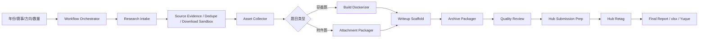

<p align="center">
  
</p>

<h1 align="center">CloverSec CTF For Example</h1>

<p align="center">
  <strong>The native Codex-compatible four-leaf clover security-specific workflow plugin: CTF competitions, information collection, question conversion, manual writing, question archiving, requirement review, and internal Hub submission</strong>
</p>


<p align="center">
  <a href="https://github.com/D1a0y1bb/CloverSec-CTF-ForExample/releases"></a>
  <a href="LICENSE"></a>
  
  
  
</p>

<p align="center">
  <a href="#overview">Overview</a> ·
  <a href="#amazing-demo">Amazing Demo</a> ·
  <a href="#quick-start">Quick Start</a> ·
  <a href="#usage">Usage</a> ·
  <a href="#workflow">Workflow</a> ·
  <a href="#capabilities">Capabilities</a> ·
  <a href="#development">Development</a>
</p>

## Overview

`CloverSec CTF For Example` 是一个 Codex 原生适配的四叶草安全-创研中心专属工作流插件，由一组可被 Codex 自动调用的 skill、脚本和 MCP server 组成。你可以直接描述目标（周期性重复工作目标），例如“收集 2025 年某比赛的 Web 题目并整理附件和 WP”，Codex 会按场景选择对应能力，生成结构化文件、证据记录、归档目录、质量检查报告、Hub 提交材料和最终 xlsx/语雀表。

以前竞赛岗工程师（实习生）花很长时间去学习去做的都是执行型工作：收集题目材料、整理附件、写 Dockerfile、调启动脚本、验证 flag、补 writeup、打包归档、填提交表。**为什么不把这些工作交给 AGENT？上帝说：要有好用的AGENT！就有了Codex**，**上帝说：要速度、格式一致性、可复现性都更好！就有了CloverSec CTF For Example**。值得深思的是，Agent 时代下如果只停在这些杂活上，就会被替代得很快。把低价值工作拿走，逼着岗位往题目设计、质量审查和赛事运营上升级，这是我希望所看到的未来。

它覆盖竞赛岗位工程师常见的长流程工作：

| 工作内容 | 插件处理方式 |
| --- | --- |
| 任务向导 | 按年份、赛事、方向、数量创建工作目录、任务计划和状态文件 |
| 赛事和赛题调研 | 多来源搜索、证据评分、结构化数据 |
| 批处理编排 | `dry-run`、`apply`、`resume` 和 `workflow_state.json` |
| 附件、源码、WP 收集 | 下载预览、hash、失败原因、来源证据 |
| 来源可信度 | 多来源证据、置信度、页面快照、下载 URL、hash、抓取时间和缺失原因 |
| 去重合并 | 按赛事、题名、分类、URL、附件 hash 和 writeup 标题生成合并候选 |
| 容器题改造 | Docker 交付、amd64 检查、build/run/save/load 记录 |
| 附件题处理 | zip/tar 检查、路径穿越风险、manifest |
| 手册撰写 | 手册草稿、Hub 字段、xlsx 字段、完整 Flag 字段 |
| 资源归档 | 归档目录、manifest、索引、语雀表 |
| 质量检查 | 题目、附件、镜像、手册、Flag、归档状态检查 |
| Hub 发布准备 | 浏览器辅助填表计划、字段 payload、提交前人工确认 |
| 审核后处理 | Hub 编号回填、镜像 tag 计划、tar 导出记录 |
| 最终交付 | `archive.xlsx`、`yuque_table.md`、`final_report.md` |

## Amazing

我们即将准备一个非常 Amazing 的演示视频，用来展示 `CloverSec CTF For Example` 这个全新推出的 Codex Plugin，用于展示 - 如何快速完成过去竞赛岗位工程师的一套完整工作：从历史题目采集、附件和 WP 整理，到镜像构建、手册撰写、质量检查、内部 Hub 浏览器辅助发布，再到归档 xlsx 和语雀表输出。

过去这些工作需要在搜索引擎、GitHub、CTF 平台、Docker、Markdown、Excel、Hub 页面之间来回切换。需要超过 1-2H 的时间去完成很繁琐机械化的工作，现在只需要在 Codex 中用一句话开始：

```text
@cloversec-ctf-forexample 帮我收集 2024-2026 年 xxxxx 比赛可复现的 Web/Pwn 赛题，整理附件、WP、镜像构建计划、手册和最终归档表。
```

这个插件采用 WorkFlow 工作流编排，把长时间、跨工具、容易漏证据的任务拆成 Codex 能执行和复核的步骤。它不会替代人的最终判断；它把信息收集、文件整理、校验记录和提交前检查尽量自动化，让工程师把时间放在确认质量和处理异常上。

## Quick Start

### 1. 在 Codex 中安装

打开 Codex 插件页，选择“添加插件市场”：

```text
来源：D1a0y1bb/CloverSec-CTF-ForExample
Git 引用：v0.3.0
稀疏路径：留空
```

然后安装 marketplace 里的 `CloverSec CTF For Example` 插件。

当然也可以使用命令行：

```bash
codex plugin marketplace add D1a0y1bb/CloverSec-CTF-ForExample --ref v0.3.0
codex plugin add cloversec-ctf-forexample@cloversec-ctf
```

### 2. 新开一个 Codex 会话

安装或更新后建议新开会话，让 Codex 重新加载 skill 和 MCP server。你可以这样说：

```text
使用 CloverSec CTF For Example，帮我收集 2025 IrisCTF 的 Web 题、writeup 和附件线索。
```

或者：

```text
根据这个 ctf_cases.jsonl，下载和整理附件、源码、WP，并输出缺失项报告。
```

### 3. 推荐准备项

| 项目 | 是否必须 | 说明 |
| --- | --- | --- |
| `gh auth login` | 推荐 | GitHub 搜索和源码抓取更稳定，不需要单独申请 API key |
| Docker Desktop | 容器题需要 | Docker 构建、运行、导出 tar、amd64 检查会用到 |
| Chrome 登录 Hub 平台 | Hub 辅助填写需要 | 插件只使用当前浏览器页面，不保存密码、Cookie、token |
| 题目目录或清单 | 推荐 | 可以是 `ctf_case.json`、`ctf_cases.jsonl`、xlsx、zip 或 URL |
| 人工入口线索 | 可选 | 冷门比赛、网盘失效、中文站收录差时会很有用 |

## Usage

使用这个插件时直接描述目标即可，无需背命令。

### 创建批量采集任务

```text
帮我创建 2025 IrisCTF Web 方向 20 道题的采集任务。
```

Codex 会使用 `cloversec-ctf-workflow-orchestrator`。常见输出：

```text
task_plan.json
workflow_state.json
ctf_cases.jsonl
next_steps.md
logs/
evidence/
snapshots/
downloads_sandbox/
downloads_accepted/
```

### 收集题目线索

```text
帮我收集 2024 LA CTF 的 Web 题、WP 和附件线索。
```

Codex 会使用 `cloversec-ctf-research-intake`，并优先调用搜索相关 MCP。常见输出：

```text
search_results.json
ctf_cases.jsonl
research_report.md
```

搜索来源包括 GitHub、CTFTime、公开 writeup 仓库、公开归档站、DuckDuckGo HTML、CSDN、博客园、语雀 site 搜索、CTF 平台入口线索，以及 Codex 当前会话可用的联网搜索工具。

### 下载和整理附件、WP、源码

```text
根据这个 ctf_cases.jsonl 收集附件和 writeup。
```

Codex 会使用 `cloversec-ctf-asset-collector`。它会记录来源、hash、下载失败原因，不会把搜索页、登录页、HTTP 错误页当成附件。常见输出：

```text
downloads/
asset_inventory.json
asset_downloads.json
asset_collection_report.md
```

### 把题目整理成容器交付件

```text
把这个题目目录整理成 CloverSec 平台可用 Docker 交付。
```

Codex 会使用 `cloversec-ctf-build-dockerizer`。它会先给方案摘要，涉及改文件前需要你确认。常见输出：

```text
Dockerfile
start.sh
changeflag.sh
flag
check/check.sh
environment.json
docker_artifacts.json
xlsx_fields.json
```

如果你明确授权执行 Docker 验证，插件可以通过 `cloversec-ctf-docker` 记录 build、run、logs、stop、save、load、inspect、amd64 校验、端口、hash 和失败证据。

### 处理纯附件题

```text
检查这个附件题 zip，生成归档用 manifest。
```

Codex 会使用 `cloversec-ctf-attachment-packager`。它会检查能否解压、文件 hash、目录清单、路径穿越风险，并输出可归档字段。常见输出：

```text
attachment_manifest.json
standard_attachment.zip
xlsx_fields.json
```

### 生成手册和录题字段

```text
根据这个题目目录生成手册、Hub 字段和 xlsx 字段。
```

Codex 会使用 `cloversec-ctf-writeup-scaffold`。完整 Flag 会保留在字段文件里。常见输出：

```text
manual_template.md
manual_filled_draft.md
writeup_context.json
hub_fields.json
xlsx_fields.json
```

### 生成归档目录

```text
把这些题目整理成最终 archive 目录。
```

Codex 会使用 `cloversec-ctf-archive-packager` 和 `cloversec-ctf-archive` MCP。常见目录：

```text
archive/
  challenge-name/
    source/
    attachments/
    image/
    writeup/
    screenshots/
    manifests/
archive_manifest.json
```

### 提交前质量检查

```text
检查这个题目归档是否能提交。
```

Codex 会使用 `cloversec-ctf-quality-review` 和 `cloversec-ctf-quality-runner`。它会把题目资源、Docker 验证、附件检查、手册内容、Flag 字段和归档状态汇总成证据。常见输出：

```text
quality_review.json
quality_review_report.md
quality_evidence/
```

### 生成 Hub 提交材料

```text
根据 hub_fields.json 和手册生成 Hub 提交包。
```

Codex 会使用 `cloversec-ctf-hub-submission`。它可以生成字段 payload、上传清单、浏览器辅助填表计划和提交前检查。Hub 相关规则：

不保存账号、密码、Cookie、token、localStorage、sessionStorage。只在用户当前 Chrome 已登录 Hub 后辅助填写。不自动点击最终提交按钮。分类不确定、未知附件上传、最终提交都需要人确认。

### 审核通过后回填 Hub 编号和镜像 tag

```text
HUB 编号是 CTF-2026060001，帮我生成 retag 计划。
```

Codex 会使用 `cloversec-ctf-hub-retag`。如果你授权 Docker 操作，可以重新 tag、导出 amd64 tar，并回写归档字段。常见输出：

```text
retag_plan.json
retag_report.md
docker_artifacts.json
```

### 生成最终报告、xlsx 和语雀表

```text
基于归档结果生成最终报告、xlsx 和语雀表。
```

Codex 会使用 `cloversec-ctf-final-report`。常见输出：

```text
final_report.md
archive.xlsx
yuque_table.md
final_report.json
```

最常见的一条完整链路：

```text
收集线索 -> 下载材料 -> 容器化/附件检查 -> 生成手册 -> 归档 -> 质量检查 -> Hub 提交包 -> 最终报告
```

## Workflow



## Capabilities

### Skills

| Skill | 作用 |
| --- | --- |
| `cloversec-ctf-workflow-orchestrator` | 创建批量采集任务、状态机、搜索策略、证据、去重和下载沙箱 |
| `cloversec-ctf-research-intake` | 收集赛事、赛题、writeup、附件线索和证据 |
| `cloversec-ctf-asset-collector` | 下载和整理源码、附件、WP、截图、hash 与失败原因 |
| `cloversec-ctf-build-dockerizer` | 将容器题整理成 Docker 交付件 |
| `cloversec-ctf-attachment-packager` | 检查和整理非容器附件题 |
| `cloversec-ctf-writeup-scaffold` | 生成题目手册、Hub 字段、xlsx 字段 |
| `cloversec-ctf-archive-packager` | 生成归档目录、manifest 和资源清单 |
| `cloversec-ctf-quality-review` | 检查题目、手册、附件、镜像和 Flag 字段 |
| `cloversec-ctf-hub-submission` | 生成 Hub 提交包和浏览器辅助填表计划 |
| `cloversec-ctf-hub-retag` | 审核通过后处理 Hub 编号、镜像 tag 和 tar |
| `cloversec-ctf-final-report` | 生成最终报告、xlsx 和语雀表 |

### MCP Servers

| MCP server | 作用 |
| --- | --- |
| `cloversec-ctf-search` | 基础免费源搜索，覆盖 CTFTime、GitHub public、公开 seeds |
| `cloversec-ctf-search-plus` | 统一 GitHub、CTFTime、归档站、writeup 站、浏览器结果、URL 预览和来源评分 |
| `cloversec-ctf-browser-search` | 读取用户确认后的浏览器可见搜索结果，输出 `visible_results.json` |
| `cloversec-ctf-docker` | 受控执行 Docker build/load/inspect/run/logs/stop/save |
| `cloversec-ctf-archive` | 批量读取 `ctf_cases.jsonl`，生成归档目录、manifest、xlsx 和缺失项报告 |
| `cloversec-ctf-quality-runner` | 汇总资源、Docker、手册、Flag 和归档质量证据 |
| `cloversec-ctf-hub-assistant` | 生成 Hub 页面字段计划和浏览器辅助填写数据 |
| `cloversec-ctf-workflow` | 创建工作流任务、GitHub 检测、搜索策略、证据快照、去重、下载沙箱 |

## Search Strategy

默认不要求用户申请付费搜索 API key。推荐配置：

```bash
gh auth login
```

搜索策略：

1. `cloversec-ctf-workflow-orchestrator` 先按 Web/Pwn/Reverse/Crypto/Misc/Forensics/AI 生成专用 query。
2. 如果当前 Codex 会话有联网搜索工具，先让 Agent 查 Google/Baidu/全网结果，再把结果写入插件的数据模型。
3. 插件脚本使用默认免费源：GitHub、CTFTime、公开 writeup 仓库、公开归档站、DuckDuckGo HTML、CSDN、博客园、语雀 site 搜索、CTF 平台入口线索。
4. 浏览器辅助搜索用于 Google/Baidu/CSDN/语雀/博客园等页面，只读取页面可见标题、URL、摘要和排名。
5. 搜索结果分层：`confirmed_challenge`、`writeup_candidate`、`attachment_candidate`、`platform_lead`、`noise`。
6. 赛事名、年份、题目名、分类和附件类型会分开评分，平台首页和搜索首页会被降级或剔除。

0.3.0 增加的安全下载流程：

- 外部附件先进入 `downloads_sandbox/`。
- 默认单文件上限 300MB。
- 默认最多跟随 5 次重定向，跳转到 localhost 或内网地址会停止。
- 禁止 `file://`、`ftp://`、localhost 和内网 IP。
- zip/tar 先做安全预览，检查路径穿越、文件数量和解压体积。
- 人工确认后再进入 `downloads_accepted/` 或题目目录。

现实边界：

- 搜索能力有边界，无法保证拿到所有附件。
- 冷门比赛、中文站点收录差、附件下架、网盘失效时，需要 Agent 联网搜索、Chrome 浏览器辅助搜索或人工提供入口。
- 插件不会绕过验证码、登录限制、付费墙或访问控制。

## Hub Automation

Hub 自动化的目标是“辅助填写到最终提交前”，最终提交仍由人确认。

它可以做：

- 检查当前 Chrome 是否已经进入已登录 Hub 页面。
- 生成字段 payload 和上传清单。
- 打开提交页面并辅助填写字段。
- 上传前后记录页面可见结果和差异。
- 停在最终提交前，让人确认。

它不会做：

- 保存账号、密码、Cookie、token、session。
- 自动点击最终提交。
- 自造分类 ID、Hub 编号或审核结果。
- 登录态不存在时先填表再跳转登录。

## Repository Layout

```text
.
├── .agents/plugins/marketplace.json
├── plugins/cloversec-ctf-forexample/
│   ├── .codex-plugin/plugin.json
│   ├── .mcp.json
│   ├── assets/
│   │   └── app-icon.png
│   ├── references/
│   ├── scripts/
│   └── skills/
├── scripts/
│   ├── package_plugin_release.py
│   └── validate_release.py
├── tests/
├── AGENTS.md
├── TODO.md
├── LICENSE
└── README.md
```

## Development

本仓库开发的是 Codex plugin。插件源码在：

```text
plugins/cloversec-ctf-forexample/
```

基础验证：

```bash
python3 scripts/validate_release.py
python3 -m unittest discover -s tests -p 'test_*.py'
```

单个 skill 快速校验示例：

```bash
python3 - <<'PY'
from pathlib import Path

for path in sorted(Path("plugins/cloversec-ctf-forexample/skills").glob("*/SKILL.md")):
    text = path.read_text(encoding="utf-8")
    if "description:" not in text:
        raise SystemExit(f"missing description: {path}")
print("skills ok")
PY
```

发布包生成：

```bash
python3 scripts/package_plugin_release.py
```

发布到 GitHub Release 后，Codex 可以按 tag 安装：

```bash
codex plugin marketplace add D1a0y1bb/CloverSec-CTF-ForExample --ref v0.3.0
codex plugin add cloversec-ctf-forexample@cloversec-ctf
```

Release assets 通常包含：

```text
cloversec-ctf-forexample-<version>.zip
cloversec-ctf-forexample-<version>.tar.gz
cloversec-ctf-forexample-<version>-repo-marketplace.zip
```

## Boundaries

- 真实 Docker 执行只应在用户明确授权和题目来源可信时进行。
- 未验证的搜索结果不能写成事实。
- Hub 最终提交、分类不确定、未知附件上传必须由人确认。
- xlsx 和语雀归档字段必须保留完整 Flag。
- 浏览器辅助能力只读取页面可见内容，不读取或保存凭证。
- 这个仓库暂不做独立可视化工作台 App；当前重点是 Codex plugin、skill、MCP 和文件化工作流。

## Related Docs

- [OpenAI Codex plugin build docs](https://developers.openai.com/codex/plugins/build)
- [TODO.md](TODO.md)
- [AGENTS.md](AGENTS.md)

## License

MIT License. Copyright (c) 2026 D1a0y1bb.
